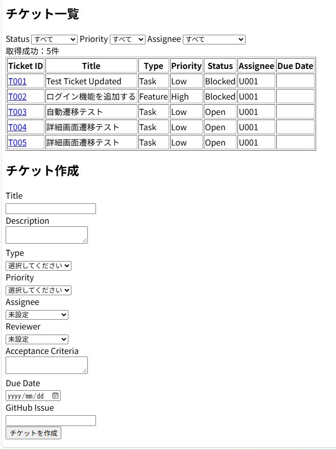

[日本語版はこちら](README_ja.md)

# TicketFlow

## 1. Project Overview

### 1.1 Project Name

TicketFlow

### 1.2 Overview

TicketFlow is a ticket management web application for small software development teams, built with Google Apps Script (GAS).

The application manages tasks through tickets, including task registration, assignment, progress, comments, and change history.

The development of TicketFlow itself is also managed using a ticket-driven development process. This project aims to demonstrate practical experience with ticket-driven development and make the development process traceable and visible.

---

## 2. Development Objectives

The objectives of this project are:

1. Build a system for managing tasks and issues on a ticket-by-ticket basis.
2. Manage the development process from implementation and testing through completion using tickets.
3. Associate tickets with GitHub Issues, Pull Requests, and Git history.
4. Record ticket change history so that the development process can be traced.
5. Practice ticket-driven development by managing the development of this system itself through tickets.

---

## 3. Target Users

### 3.1 Target

Members of small software development teams.

### 3.2 Users

In the MVP, detailed user permissions are not implemented. All development team members are assumed to have access to the system.

The following roles can be recorded on a ticket:

* Assignee
* Reporter
* Reviewer

---

## 4. Functional Requirements

### 4.1 Ticket Management

The system provides the following operations:

* Create tickets
* Display a ticket list
* Display ticket details
* Edit tickets
* Change ticket status
* Set ticket priority
* Assign tickets to members
* Set due dates

---

### 4.2 Ticket Types

Tickets are classified into three types.

| Type    | Description                      |
| ------- | -------------------------------- |
| Feature | Add a new feature                |
| Bug     | Fix a defect or problem          |
| Task    | Other work such as documentation |

---

### 4.3 Priority

Tickets have three priority levels.

| Priority | Description                |
| -------- | -------------------------- |
| High     | Requires priority handling |
| Medium   | Normal priority            |
| Low      | Low urgency                |

---

### 4.4 Status

Tickets use the following statuses:

* Open
* In Progress
* Review
* Testing
* Done
* Blocked

The basic workflow is:

```text
Open
  ↓
In Progress
  ↓
Review
  ↓
Testing
  ↓
Done
```

If an issue is found during review or testing, the ticket can return to `In Progress`.

```text
Review
  ↓
In Progress

Testing
  ↓
In Progress
```

`Blocked` is used when work cannot proceed.

---

### 4.5 Acceptance Criteria

Each ticket can define acceptance criteria used to determine whether the work is complete.

Example:

```text
- CSV files can be uploaded
- An error is displayed for invalid CSV files
- Valid CSV files can be loaded successfully
```

A ticket is marked as `Done` after its acceptance criteria have been verified.

---

### 4.6 Comments

Users can add comments to tickets.

Each comment records:

* Comment content
* Author
* Created At

---

### 4.7 Change History

Major changes to tickets are recorded in the history.

Examples include:

* Ticket creation
* Ticket updates
* Status changes
* Assignee changes
* Comment creation

The history records at least:

* Operation timestamp
* Actor
* Operation
* Target ticket

---

### 4.8 GitHub Association

Tickets can store GitHub Issue and Pull Request numbers.

Example:

```text
Ticket: T-0001
GitHub Issue: #1
GitHub Pull Request: #5
```

This makes it possible to trace the relationship between tickets and source code changes.

---

## 5. Ticket Fields

Each ticket stores the following information.

| Field               | Description                                            |
| ------------------- | ------------------------------------------------------ |
| Ticket ID           | Unique identifier for the ticket                       |
| Title               | Ticket title                                           |
| Description         | Description of the task or issue                       |
| Type                | Feature / Bug / Task                                   |
| Priority            | High / Medium / Low                                    |
| Status              | Open / In Progress / Review / Testing / Done / Blocked |
| Assignee            | Person responsible for the ticket                      |
| Reporter            | Person who created the ticket                          |
| Reviewer            | Person responsible for review                          |
| Acceptance Criteria | Conditions for considering the work complete           |
| Due Date            | Deadline                                               |
| GitHub Issue        | GitHub Issue number                                    |
| GitHub PR           | GitHub Pull Request number                             |
| Created At          | Creation timestamp                                     |
| Updated At          | Last update timestamp                                  |

---

## 6. Non-Functional Requirements

### 6.1 Environment

The system is designed as a web application accessible through a web browser.

### 6.2 Data Storage

Google Spreadsheet is used as the data store.

### 6.3 Development Environment

The project uses the following technologies:

* Google Apps Script
* Google Spreadsheet
* HTML
* CSS
* JavaScript
* Git
* GitHub

### 6.4 History

Major changes to tickets are recorded so that previous changes can be reviewed later.

---

## 7. Out of Scope

The following features are outside the scope of the MVP:

* User authentication
* Detailed permission management
* Email notifications
* Notifications through external services such as Slack
* AI features
* External databases
* Automatic integration using the GitHub API

These features may be considered as future extensions.

---

## 8. Development Approach

TicketFlow itself is developed using a ticket-driven development process.

The current development workflow is:

```text
GitHub Issue
    ↓
Requirements / Design Review
    ↓
Implementation
    ↓
Testing
    ↓
Git diff Review
    ↓
Git Commit
    ↓
Push
    ↓
Issue Close
```

GitHub Issues, commits, and test results are associated where possible to keep the development process traceable.

Pull Requests and formal code review are considered future extensions to the development process.

---

## 9. MVP Completion Criteria

The MVP is considered complete when the following requirements are satisfied:

* Tickets can be created
* Tickets can be listed
* Ticket details can be viewed
* Tickets can be edited
* Ticket status can be changed
* Comments can be added
* Major ticket changes can be viewed in the history
* Data can be stored in Google Spreadsheet
* Tickets can be associated with GitHub Issues
* Basic testing can be performed

---
## Screenshots

### Ticket List


---

# 10. Development Experience

TicketFlow is developed by dividing the work into GitHub Issues and following the workflow:

**Issue Creation → Implementation → Testing → Git diff Review → Commit → Push → Issue Close**

| Issue                      | Feature / Deliverable                                        | Development Experience                                                                                          |
| -------------------------- | ------------------------------------------------------------ | --------------------------------------------------------------------------------------------------------------- |
| #1 Requirements Definition | Created `requirements.md`                                    | Defined the project purpose, target users, functional scope, MVP, and non-functional requirements               |
| #2 Database Design         | Created `db-design.md`                                       | Designed the data structures, IDs, and relationships for Tickets / Comments / History / Members                 |
| #3 Screen Design           | Created `screen-design.md`                                   | Designed list, detail, create, and edit screens, including navigation, input fields, and validation             |
| #4 GAS Initial Setup       | Set up GAS, Spreadsheet, clasp, and GitHub integration       | Built the development environment using Google Apps Script, Google Spreadsheet, Node.js, clasp, and Git         |
| #5 Ticket Creation         | Implemented ticket creation                                  | Implemented input validation, automatic ID generation, timestamp recording, and creation history                |
| #6 Ticket List             | Implemented ticket list and Status/Priority/Assignee filters | Implemented data retrieval from Spreadsheet and filtering based on selected conditions                          |
| #7 Ticket Details          | Implemented ticket detail view                               | Retrieved tickets using Ticket ID from URL parameters and handled invalid/non-existent IDs                      |
| #8 Ticket Editing          | Implemented ticket editing and change history                | Compared previous and new values and recorded only changed fields in History                                    |
| #9 Status Change           | Implemented ticket status changes                            | Validated status values and recorded the previous/new values and update timestamp in History                    |
| #10 Comments               | Implemented comment creation and display                     | Implemented comment registration, automatic Comment ID generation, Ticket ID association, and input validation  |
| #11 History                | Implemented ticket history display                           | Retrieved history by Ticket ID and displayed History ID, changes, actor, and timestamp                          |
| #12 Member Selection       | Implemented Assignee / Reviewer selection                    | Retrieved member data from the Members sheet, provided dropdown selection, and implemented Member ID validation |

---

## Development Process

Each Issue follows the following development process.

```text
Create GitHub Issue
       ↓
Review Requirements / Design
       ↓
Implementation
       ↓
Testing
       ↓
Review Git diff
       ↓
Commit
       ↓
Push
       ↓
Close Issue
```

The project also follows the development rule:

**"No Ticket, No Work"**

Implementation is started after the corresponding GitHub Issue has been created.

---

## Current Features

The following features are currently implemented:

* Ticket creation
* Ticket list display
* Filtering by Status / Priority / Assignee
* Ticket detail display
* Ticket editing
* Ticket status changes
* Comment creation and display
* Change history display
* Assignee / Reviewer selection using the Members sheet
* Input validation
* Member ID validation
* Change history recording

---

## Technology Stack

* Google Apps Script
* Google Spreadsheet
* HTML
* CSS
* JavaScript
* Git
* GitHub
* clasp
* Node.js
